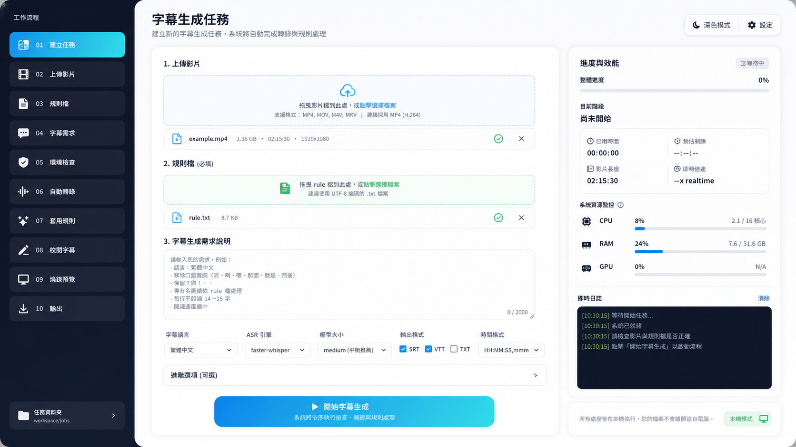
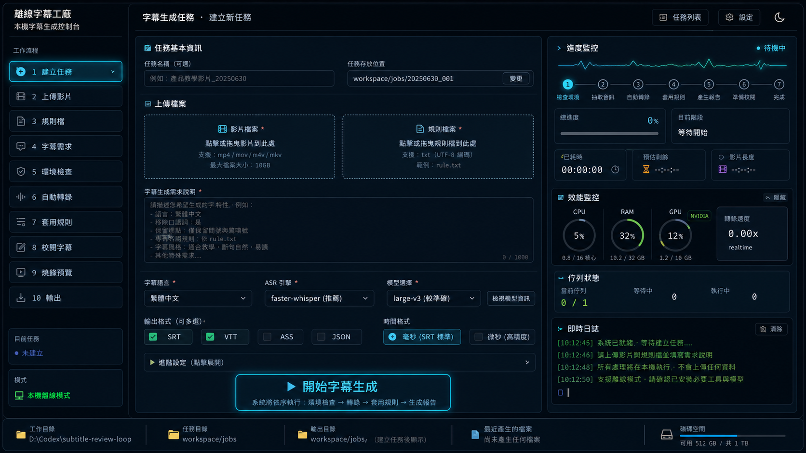
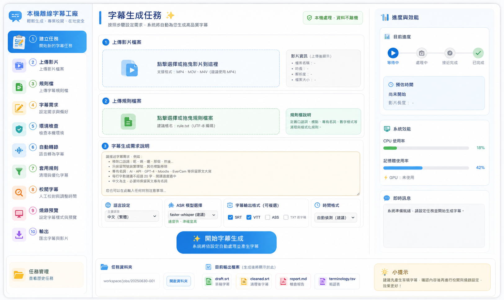
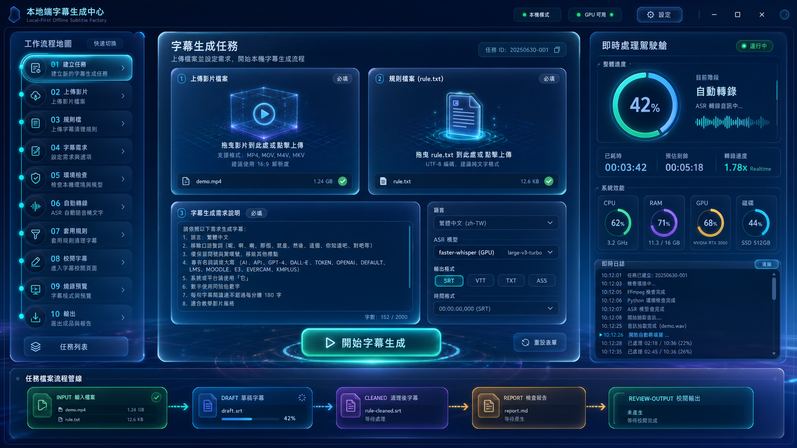

# GPT-IMAGE-2 UI 概念圖選項

本文件整理 4 種離線字幕生成前台 UI 視覺方向，供後續挑選與實作參考。

## Option 1：Apple Minimal

- 風格：Apple Keynote、極簡、留白多、專業 SaaS。
- 適合：正式產品展示、管理者、技術文件導向。
- 檔案：`assets/ui-option-1-apple-minimal.png`

## Option 2：Cyber Ops

- 風格：深色開發者控制台、即時 log、效能監控感強。
- 適合：工程師、AI Agent、批次任務與本機模型控制。
- 檔案：`assets/ui-option-2-cyber-ops.png`

## Option 3：Teacher Friendly

- 風格：教育平台、淺色、友善、非工程使用者容易理解。
- 適合：教師、行政人員、教材製作工作坊。
- 檔案：`assets/ui-option-3-teacher-friendly.png`

## Option 4：Futuristic Glass

- 風格：AI 工作流指揮中心、玻璃擬態、科技感強。
- 適合：Demo Day、產品展示、AI 工具品牌化。
- 檔案：`assets/ui-option-4-futuristic-glass.png`

## 初步建議

- 若目標使用者是教師與課程製作者，建議以 Option 3 為主。
- 若目標是開源專案展示與技術工作流，建議 Option 1 或 Option 4。
- 若要強調本機模型、任務 log 與效能監控，建議 Option 2。
